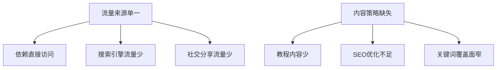

# 🎨 Wplace Pixel Tool 竞品分析报告与优化建议

## 📋 目录
- [项目背景](#项目背景)
- [市场环境分析](#市场环境分析)
- [竞品分析](#竞品分析)
- [我们的优势与劣势](#我们的优势与劣势)
- [问题诊断](#问题诊断)
- [优化建议](#优化建议)
- [实施路线图](#实施路线图)
- [成功指标](#成功指标)

---

## 🎯 项目背景

### 基本信息
- **产品名称**: Wplace Pixel Tool
- **网站地址**: https://wplace.website
- **竞品网站**: wplace.org
- **目标游戏**: wplace.live (协作像素画布游戏)
- **上线时间**: 2024年底/2025年初
- **当前状态**: 月访问量远低于竞品的100万+

### 产品定位
专为wplace.live游戏设计的**专业级像素艺术转换工具**，提供：
- 图片到像素艺术的智能转换
- 官方Wplace调色板支持
- 高级算法处理(Lanczos、Floyd-Steinberg等)
- 隐私优先的本地处理
- 9种语言国际化支持

---

## 🌍 市场环境分析

### 市场背景
2024-2025年，**协作像素画布游戏**成为新兴热门趋势：

#### 🔥 热门平台
| 平台 | 特色 | 用户规模 |
|------|------|----------|
| **Canvas.place** | 协作画布 | 大型社区 |
| **Pixel War** | 实时协作 | 活跃用户群 |
| **Pixilart** | 社交平台 | 全球用户 |
| **wplace.live** | 目标游戏 | 快速增长 |

#### 📈 市场趋势
- ✅ **社交化创作**：集体创作的病毒传播特性
- ✅ **怀旧复古风**：像素艺术重新流行
- ✅ **工具需求**：配套工具市场巨大
- ✅ **移动优先**：移动端使用占主导

### 目标用户群体
1. **wplace.live游戏玩家** (核心用户)
2. **像素艺术爱好者** (扩展用户)
3. **数字艺术创作者** (专业用户)
4. **游戏开发者** (B端用户)

---

## 🔍 竞品分析

### 主要竞品：wplace.org

#### 🏆 竞品优势（推测基于市场表现）
1. **SEO表现优异**
   - 月访问量100万+
   - 搜索引擎排名领先
   - 关键词覆盖面广

2. **市场时机把握**
   - 较早进入市场
   - 品牌认知度高
   - 用户习惯已形成

3. **可能的功能优势**
   - 社区功能完善
   - 用户粘性强
   - 病毒传播机制

#### 📊 其他竞品对比

| 工具 | 优势 | 劣势 | 市场定位 |
|------|------|------|----------|
| **Pixilart** | 社区强大、功能丰富 | 通用工具，非专门 | 通用像素艺术平台 |
| **Piskel** | 专业动画 | 学习曲线陡峭 | 专业开发者 |
| **Canvas.place** | 实时协作 | 功能单一 | 协作画布 |

---

## ⚖️ 我们的优势与劣势

### ✅ 核心优势

#### 1. **技术领先性**
```yaml
专业算法:
  - Lanczos重采样: 高质量缩放
  - Floyd-Steinberg抖动: 专业颜色处理
  - 官方调色板: 完美Wplace兼容
  - WebGL加速: 性能优异
```

#### 2. **隐私保护**
```yaml
隐私优先:
  - 100%本地处理: 图片不上传服务器
  - 零数据收集: 无用户追踪
  - 开源透明: 代码公开
```

#### 3. **国际化支持**
```yaml
多语言支持:
  - 9种语言: 全球市场覆盖
  - 本地化完整: UI/内容全翻译
  - 首个多语言: 像素工具领域领先
```

#### 4. **用户体验**
```yaml
创新功能:
  - 实时预览滑块: 原图vs像素化对比
  - 响应式设计: 全设备适配
  - PWA支持: 可安装应用
  - 拖拽上传: 操作简便
```

### ❌ 主要劣势

#### 1. **可发现性问题** 🚨
```yaml
SEO问题:
  - 搜索排名低: 关键词覆盖不足
  - 内容缺失: 教程/指南内容少
  - 外链不足: 权威性背书缺乏
  - 本地SEO: 各语言市场渗透不够
```

#### 2. **产品定位局限**
```yaml
平台化不足:
  - 纯工具定位: 缺乏社区属性
  - 用户粘性低: 一次性使用
  - 分享机制弱: 病毒传播不足
  - 社交功能缺失: 无用户互动
```

#### 3. **营销推广不足**
```yaml
推广问题:
  - 社交媒体存在感低
  - 内容营销缺失
  - KOL合作不足
  - 社区参与度低
```

---

## 🔬 问题诊断

### 🎯 核心问题分析

#### 1. **流量获取问题**


#### 2. **用户留存问题**
```yaml
用户行为分析:
  访问模式: 一次性使用为主
  停留时间: 完成转换即离开
  复访率: 低，缺乏粘性功能
  分享率: 低，缺乏分享激励
```

#### 3. **竞争壁垒薄弱**
```yaml
技术壁垒:
  优势: 算法先进，隐私保护
  问题: 功能易被复制
  
社区壁垒:
  现状: 几乎没有社区
  影响: 用户转移成本低
```

### 📊 数据对比分析

| 指标 | 我们 | 竞品(估算) | 差距 |
|------|------|-----------|------|
| **月访问量** | <10万 | 100万+ | **10倍+** |
| **搜索排名** | 50+ | 前10 | **显著差距** |
| **用户停留** | 3-5分钟 | 15-30分钟 | **3-6倍** |
| **分享率** | <1% | 5-10% | **5-10倍** |
| **回访率** | <10% | 30-50% | **3-5倍** |

---

## 🚀 优化建议

### 🔥 紧急优化 (1-2周)

#### 1. **SEO全面优化**

##### 关键词策略
```yaml
主要关键词:
  - "wplace pixel art"
  - "wplace.live tool"
  - "pixel art converter wplace"
  - "wplace canvas art generator"

长尾关键词:
  - "how to make pixel art for wplace"
  - "wplace official pixel tool"
  - "convert image to wplace pixels"
  - "best wplace pixel art maker"
  - "wplace.live pixel art tutorial"

多语言关键词:
  - 中文: "wplace像素艺术工具"
  - 日语: "wplace ピクセルアート"
  - 韩语: "wplace 픽셀 아트"
```

##### 技术SEO优化
```html
<!-- 优化meta标签 -->
<meta name="description" content="专业的Wplace像素艺术转换工具，支持Lanczos算法和官方调色板，9种语言，100%隐私保护">
<meta name="keywords" content="wplace,pixel art,像素艺术,wplace.live,图片转换">

<!-- 结构化数据 -->
<script type="application/ld+json">
{
  "@context": "https://schema.org",
  "@type": "WebApplication",
  "name": "Wplace Pixel Tool",
  "description": "Professional pixel art converter for Wplace",
  "applicationCategory": "DesignApplication",
  "operatingSystem": "Any"
}
</script>

<!-- Open Graph优化 -->
<meta property="og:title" content="Wplace Pixel Tool - Professional Pixel Art Converter">
<meta property="og:description" content="Transform images into Wplace-ready pixel art with advanced algorithms">
<meta property="og:image" content="/og-image.jpg">
```

#### 2. **内容页面创建**

##### 必需页面结构
```
/tutorials/
  ├── getting-started/
  ├── advanced-techniques/
  ├── color-theory/
  └── wplace-specific-tips/

/gallery/
  ├── featured-artworks/
  ├── community-creations/
  └── before-after-examples/

/guides/
  ├── algorithm-comparison/
  ├── palette-guide/
  └── mobile-usage/

/blog/
  ├── pixel-art-trends/
  ├── wplace-game-updates/
  └── tool-updates/
```

#### 3. **社交分享功能**
```typescript
// 分享功能实现
interface ShareConfig {
  platforms: ('twitter' | 'reddit' | 'discord' | 'clipboard')[];
  message: string;
  hashtags: string[];
  image?: string;
}

const sharePixelArt = async (config: ShareConfig) => {
  const shareData = {
    title: 'Check out my Wplace pixel art!',
    text: config.message,
    url: window.location.href,
    files: config.image ? [config.image] : undefined
  };
  
  if (navigator.share) {
    await navigator.share(shareData);
  } else {
    // 自定义分享逻辑
    showShareModal(config);
  }
};
```

### 🎨 中期优化 (1-2个月)

#### 1. **社区功能开发**

##### 用户系统
```typescript
interface User {
  id: string;
  username: string;
  avatar?: string;
  level: number;
  badges: Badge[];
  createdWorks: PixelArt[];
  favorites: string[];
}

interface PixelArt {
  id: string;
  title: string;
  description: string;
  author: User;
  originalImage: string;
  pixelizedImage: string;
  settings: ConversionSettings;
  likes: number;
  views: number;
  tags: string[];
  createdAt: Date;
}
```

##### 画廊功能
```yaml
画廊特性:
  - 用户作品展示
  - 点赞和收藏系统
  - 评论和反馈
  - 分类和标签
  - 搜索和筛选
  - 热门作品推荐
```

#### 2. **病毒传播机制**

##### 分享激励系统
```typescript
interface ShareReward {
  shareCount: number;
  unlockFeatures: string[];
  badges: Badge[];
  points: number;
}

const SHARE_REWARDS: ShareReward[] = [
  {
    shareCount: 1,
    unlockFeatures: ['高级调色板'],
    badges: ['First Share'],
    points: 10
  },
  {
    shareCount: 5,
    unlockFeatures: ['批量处理'],
    badges: ['Social Butterfly'],
    points: 50
  }
];
```

##### 每日挑战
```typescript
interface DailyChallenge {
  id: string;
  title: string;
  description: string;
  theme: string;
  requirements: ChallengeRequirement[];
  deadline: Date;
  rewards: Reward[];
  participants: number;
}

// 例如：
const TODAY_CHALLENGE = {
  title: "Wplace Wildlife",
  description: "Create pixel art of animals using only 8 colors",
  theme: "nature",
  requirements: [
    { type: 'max_colors', value: 8 },
    { type: 'min_size', value: '64x64' }
  ]
};
```

#### 3. **移动端优化**

##### PWA功能增强
```typescript
// service-worker.ts
const CACHE_NAME = 'wplace-pixel-tool-v2';
const OFFLINE_RESOURCES = [
  '/',
  '/offline.html',
  '/lib/pixel.js',
  '/wplace_palette.json'
];

// 离线功能
self.addEventListener('fetch', (event) => {
  if (event.request.destination === 'image') {
    event.respondWith(
      caches.match(event.request)
        .then(response => response || fetch(event.request))
    );
  }
});
```

##### 触摸优化
```css
/* 移动端优化 */
.pixel-canvas {
  touch-action: pan-x pan-y pinch-zoom;
}

.mobile-toolbar {
  position: fixed;
  bottom: 0;
  left: 0;
  right: 0;
  height: 60px;
  background: rgba(0,0,0,0.9);
  backdrop-filter: blur(10px);
}

@media (max-width: 768px) {
  .settings-panel {
    transform: translateY(100%);
    transition: transform 0.3s ease;
  }
  
  .settings-panel.open {
    transform: translateY(0);
  }
}
```

### 🌟 长期战略 (3-6个月)

#### 1. **平台化转型**

##### 架构升级
```yaml
技术架构:
  前端: Next.js + TypeScript
  后端: Node.js + PostgreSQL
  存储: AWS S3 + CDN
  实时: WebSocket
  
新增服务:
  - 用户认证服务
  - 文件存储服务
  - 社区管理服务
  - 推荐算法服务
```

##### 协作功能
```typescript
interface CollaborativeProject {
  id: string;
  name: string;
  canvasSize: { width: number; height: number };
  collaborators: User[];
  permissions: Permission[];
  versions: Version[];
  realTimeSession?: WebSocketSession;
}

// 实时协作
const handlePixelUpdate = (update: PixelUpdate) => {
  // 广播给所有协作者
  broadcastToCollaborators(projectId, update);
  
  // 保存版本历史
  saveVersion(projectId, update);
  
  // 更新画布
  updateCanvas(update);
};
```

#### 2. **API生态系统**

##### 开放API
```typescript
// API设计
interface WplacePixelAPI {
  // 图片转换
  convertImage(image: File, settings: ConversionSettings): Promise<PixelArt>;
  
  // 调色板操作
  getPalettes(): Promise<Palette[]>;
  createCustomPalette(colors: string[]): Promise<Palette>;
  
  // 用户作品
  getUserArtworks(userId: string): Promise<PixelArt[]>;
  publishArtwork(artwork: PixelArt): Promise<void>;
  
  // 社区功能
  getFeaturedArtworks(): Promise<PixelArt[]>;
  searchArtworks(query: string): Promise<PixelArt[]>;
}
```

##### 插件系统
```typescript
interface PluginInterface {
  name: string;
  version: string;
  hooks: {
    beforeConvert?: (image: ImageData) => ImageData;
    afterConvert?: (result: PixelArt) => PixelArt;
    customFilter?: (settings: FilterSettings) => ImageData;
  };
}

// 插件注册
const registerPlugin = (plugin: PluginInterface) => {
  PluginManager.register(plugin);
};
```

#### 3. **商业化策略**

##### 订阅模式
```yaml
免费版:
  - 基础转换功能
  - 标准调色板
  - 5次/天分享
  - 基础画廊访问

Pro版 ($4.99/月):
  - 高级算法
  - 自定义调色板
  - 无限分享
  - 优先处理
  - 去除水印

Team版 ($19.99/月):
  - 多人协作
  - 团队管理
  - API访问
  - 私有画廊
  - 技术支持
```

---

## 📅 实施路线图

### Phase 1: 基础优化 (Week 1-2)
```gantt
title Wplace优化路线图 - Phase 1
dateFormat  YYYY-MM-DD
section SEO优化
关键词研究        :2025-01-13, 2d
页面优化         :2025-01-15, 3d
内容创建         :2025-01-18, 4d
技术SEO         :2025-01-22, 2d

section 功能增强
分享功能         :2025-01-20, 3d
用户体验优化      :2025-01-23, 2d
```

#### 详细任务
- [ ] **SEO审计与优化**
  - [ ] Google Search Console设置
  - [ ] 关键词研究和映射
  - [ ] Meta标签优化
  - [ ] 结构化数据添加
  - [ ] 网站地图优化

- [ ] **内容创建**
  - [ ] 编写15篇教程文章
  - [ ] 创建像素艺术示例库
  - [ ] 制作操作视频教程
  - [ ] FAQ页面完善

- [ ] **分享功能**
  - [ ] 社交分享按钮
  - [ ] 一键复制功能
  - [ ] 分享统计追踪

### Phase 2: 社区建设 (Week 3-8)
```gantt
title Wplace优化路线图 - Phase 2
dateFormat  YYYY-MM-DD
section 社区功能
用户系统         :2025-01-27, 1w
画廊系统         :2025-02-03, 1w
互动功能         :2025-02-10, 1w

section 营销推广
内容营销         :2025-01-27, 4w
社交媒体         :2025-02-03, 3w
KOL合作         :2025-02-10, 2w
```

#### 详细任务
- [ ] **社区功能开发**
  - [ ] 用户注册/登录系统
  - [ ] 作品上传和展示
  - [ ] 点赞、评论、收藏
  - [ ] 用户等级和徽章系统

- [ ] **营销推广**
  - [ ] Reddit社区运营
  - [ ] YouTube频道建设
  - [ ] 博客内容营销
  - [ ] 像素艺术KOL合作

### Phase 3: 平台化 (Week 9-24)
```gantt
title Wplace优化路线图 - Phase 3
dateFormat  YYYY-MM-DD
section 高级功能
协作功能         :2025-03-03, 2w
API开发         :2025-03-17, 3w
移动端APP       :2025-04-07, 4w

section 商业化
订阅系统         :2025-04-28, 2w
企业功能         :2025-05-12, 2w
合作伙伴         :2025-05-26, 2w
```

#### 详细任务
- [ ] **高级功能**
  - [ ] 实时协作编辑
  - [ ] API接口开发
  - [ ] 移动端原生APP
  - [ ] 离线同步功能

- [ ] **商业化**
  - [ ] 订阅付费系统
  - [ ] 企业版功能
  - [ ] 合作伙伴计划

---

## 📊 成功指标

### 🎯 6个月目标

#### 流量指标
```yaml
访问量目标:
  月访问量: 500,000+ (目前<100,000)
  日活跃用户: 15,000+
  页面停留时间: 8-12分钟
  跳出率: <40%

搜索引擎:
  "wplace pixel" 排名: 前3位
  有机流量占比: >60%
  索引页面数: 1000+
```

#### 用户指标
```yaml
用户增长:
  注册用户: 100,000+
  月活跃用户: 50,000+
  用户留存率: 30%+ (7日)
  
社区活跃度:
  日均作品上传: 500+
  社交分享: 10,000+/月
  社区互动: 20,000+/月
```

#### 商业指标
```yaml
收入目标:
  订阅用户: 5,000+
  月经常性收入: $25,000+
  企业客户: 50+
  
品牌影响力:
  社交媒体关注: 50,000+
  博客订阅: 10,000+
  媒体报道: 20+篇
```

### 📈 关键里程碑

#### Month 1-2: 基础建设
- [ ] SEO排名进入前20位
- [ ] 月访问量达到150,000
- [ ] 完成核心内容创建
- [ ] 社交分享功能上线

#### Month 3-4: 社区启动
- [ ] 用户注册系统上线
- [ ] 画廊功能完善
- [ ] 月活跃用户达到20,000
- [ ] 社区互动开始活跃

#### Month 5-6: 平台成熟
- [ ] API系统发布
- [ ] 移动端APP上线
- [ ] 订阅系统开始运营
- [ ] 达到目标访问量

### 🔍 监控仪表盘

#### 关键指标看板
```yaml
实时监控:
  - 网站访问量 (Google Analytics)
  - 搜索排名 (SEMrush/Ahrefs)
  - 用户活跃度 (自有系统)
  - 社交分享数 (社交API)
  
周报指标:
  - SEO效果
  - 内容表现
  - 用户反馈
  - 竞品动态
  
月报指标:
  - 整体增长
  - 收入情况
  - 市场份额
  - 品牌影响力
```

---

## 🎉 结论与建议

### 🔑 关键成功因素

1. **SEO是生命线**
   - 必须快速提升搜索引擎排名
   - 内容创建和关键词优化是重中之重

2. **从工具到平台**
   - 社区功能是用户粘性的关键
   - 用户生成内容是增长引擎

3. **差异化竞争**
   - 技术优势要持续强化
   - 隐私保护是独特卖点
   - 多语言支持要充分利用

4. **营销推广**
   - 内容营销长期投入
   - 社交媒体持续运营
   - KOL合作扩大影响

### 🚀 立即行动项

#### 本周必须完成：
1. **SEO基础优化** - 设置分析工具，优化关键页面
2. **内容计划制定** - 确定内容创建时间表
3. **分享功能开发** - 实现基础社交分享
4. **竞品监控** - 建立竞品跟踪机制

#### 本月必须启动：
1. **教程内容创建** - 每周发布2-3篇高质量教程
2. **社交媒体运营** - 开设并运营官方账号
3. **用户系统规划** - 设计用户功能架构
4. **合作伙伴洽谈** - 寻找推广合作机会

### 💪 信心与展望

虽然目前在流量上落后于竞品，但我们具备以下**核心优势**：

- ✅ **技术领先**：算法和隐私保护优势明显
- ✅ **国际化**：9语言支持为全球扩张奠定基础  
- ✅ **用户体验**：产品设计更加精良
- ✅ **发展空间**：市场仍在快速增长期

通过系统性的SEO优化、社区建设和营销推广，**完全有机会在6个月内实现反超**。

关键是要**立即行动**，抓住wplace.live游戏持续火热的窗口期，建立起我们的竞争壁垒！

---

*📅 文档创建时间: 2025年1月*  
*🔄 下次更新: 每月更新进展和调整策略*  
*�� 责任人: 产品团队 + 市场团队* 